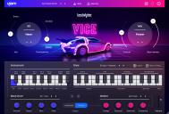

# VST plugins
<!-- copyright: ReSampled -->

[18:11:39] 

### ANA 2

-----

### Avatar ST

-----

### BlueARP

-----

### BM-DOPE

-----

### BM-EDEN

-----

### BM-GLORY

-----

### BM-HUSTLE

-----

### BM-HYPE

-----

### BM-KANDY

-----

### BM-NEMESIS

-----

### BM-VICE

-----

### BM-VOID

-----

### CMI V

-----

### Ctrlr-VST

-----

### D-50

-----

### DSK Ethereal PadZ 2

-----

### Equinoxe

-----

### EZkeys

-----

### GM-ONE

-----

### Hive

-----

### Kairatune

-----

### Kontakt

-----

### Melody Sauce

-----

### Nexus

-----

### Nora

-----

### Orb Arpeggios

-----

### Orb Bass

-----

### Orb Chords

-----

### Orb Melody

-----

### Quiet Piano

-----

### Serenity SE

-----

### Spire_x64_v1.1.15

-----

### UVIWorkstation

-----

### VG-AMBER

-----

### VG-CARBON

-----

### VG-IRON

-----

### VG-SILK

-----

### VG-SPARKLE

-----

### VPS Avenger

-----

### ZENOLOGY

-----

### Sonible - smart:EQ 3

Одновременно обрабатывайте до шести треков за раз с помощью 24 фильтров, обработки M/S, интеллектуальных состояний и многого другого.

Последний интеллектуальный плагин Sonible на базе искусственного интеллекта: EQ 3, позиционируемый как «первый в мире многодорожечный эквалайзер». Он способен анализировать несколько звуковых дорожек для создания спектрального баланса и удаления нежелательных резонансов.
