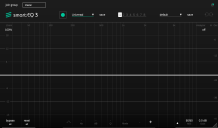
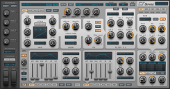

# VST plugins
<!-- copyright: ReSampled -->

[18:14:11] 

### ANA 2

### Avatar ST

### BlueARP

### BM-DOPE

### BM-EDEN

### BM-GLORY

### BM-HUSTLE

### BM-HYPE

### BM-KANDY

### BM-NEMESIS

### BM-VICE

### BM-VOID

### CMI V

### Ctrlr-VST

### D-50

### DSK Ethereal PadZ 2

### Equinoxe

### EZkeys

### GM-ONE

### Hive

### Kairatune

### Kontakt

### Melody Sauce

### Nexus

### Nora

### Orb Arpeggios

### Orb Bass

### Orb Chords

### Orb Melody

### Quiet Piano

### Serenity SE

### Spire_x64_v1.1.15

### UVIWorkstation

### VG-AMBER

### VG-CARBON

### VG-IRON

### VG-SILK

### VG-SPARKLE

### VPS Avenger

### ZENOLOGY

### Sonible - smart:EQ 3

Одновременно обрабатывайте до шести треков за раз с помощью 24 фильтров, обработки M/S, интеллектуальных состояний и многого другого.

Последний интеллектуальный плагин Sonible на базе искусственного интеллекта: EQ 3, позиционируемый как «первый в мире многодорожечный эквалайзер». Он способен анализировать несколько звуковых дорожек для создания спектрального баланса и удаления нежелательных резонансов.
